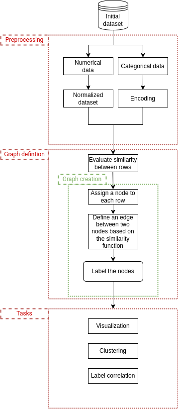

# GraphCluster

GraphCluster is a Python library for creating a graph representation of tabular data.

## Features

- **Normalization:** Preprocess tabular data, particularly CSV files, for better analysis.
- **Distance Metrics:** Evaluate distances between rows using user-defined metrics.
- **Graph Creation:** Generate graphs using the igraph library with edges based on distance metrics.
- **Centrality Measurement:** Assess centrality to classify the typicality of entries.

## Quickstart

### Downloading the Repository

To get started, clone the repository using the following command:

```bash
git clone https://github.com/davidetorre92/GraphCluster.git
```
### Installing Requirements
Navigate to the repository directory and install the required dependencies using:
```bash
pip install -r requirements.txt
```

### Similarity Evaluation
1. Open the script graph_definition/evaluate_similarity.py.
2. Change the path of the desired file and the output similarity dataframe.
3. Run the script with the following command:

```python
python3 graph_definition/evaluate_similarity.py
```

### Graph Creation
1. Open the script graph_definition/graph_creation.py.
2. Change the name of the similarity dataframe and set the threshold.
3. Run the script with the following command:

```python
python3 graph_definition/graph_creation.py
```
### Graph Visualization
Run the script for graph visualization using:
```python
python3 tasks/visualization.py
```


## Flowchart


## Folder organization
For folder organization refer to 'A Quick Guide to Organizing Computational Biology Projects' by William Stafford Noble
https://doi.org/10.1371/journal.pcbi.1000424

https://journals.plos.org/ploscompbiol/article?id=10.1371/journal.pcbi.1000424#s4
